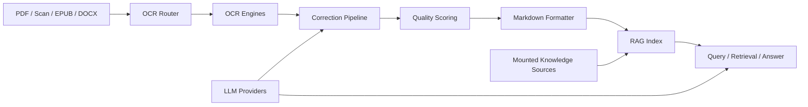

# Lumia ScriptorRAG

> A local-first OCR orchestration + Markdown refinement + RAG knowledge system for long-form documents, scans, books, and research corpora.
>
> 一个面向长文档、扫描件、书籍与资料库的本地优先系统：先做 OCR 智能编排，再做 Markdown 排版清洗，最后进入可追溯引用的 RAG 知识库。


## Why this project

Most document tools stop at one step:

- OCR tools only extract text
- Markdown tools only clean formatting
- RAG tools only index already-clean data

**Lumia ScriptorRAG** connects the full chain:

```text
PDF / Scan / Books
  → OCR routing
  → correction + quality scoring
  → Markdown refinement
  → RAG indexing
  → cited retrieval & answer generation
```

That makes it useful both as:

- a **production OCR workbench**
- a **document cleanup pipeline**
- a **general-purpose private RAG system**
- a **developer-friendly platform** where each module can still be used independently

---

## 中文简介

**Lumia ScriptorRAG（序光文枢 RAG）** 是一个把：

- 多引擎 OCR 智能路由
- Markdown 排版清洗
- 本地 / 外部知识库挂载
- 可追溯引用的 RAG 问答

融合在一起的完整文档智能系统。

它的核心不是“只识别文字”，而是把旧文档从“难用的 PDF / 扫描件”一路转换成：

- 可阅读的 Markdown
- 可复核的结构化内容
- 可检索的知识索引
- 可引用来源的问答结果

适合：

- 古籍 / 医书 / 研究资料数字化
- PDF → Markdown 大规模转换
- 自建私有知识库
- OCR + RAG 产品化落地
- 做成桌面端 / 本地部署 / 开源项目继续演进

---

## English Overview

**Lumia ScriptorRAG** is a local-first document intelligence platform that combines:

- multi-engine OCR orchestration
- post-OCR correction and quality scoring
- Markdown cleanup and formatting
- mounted external knowledge sources
- citation-friendly RAG retrieval and answer generation

The product is designed for teams and individuals who need a reliable pipeline from raw PDF scans to reusable knowledge assets.

---

## Core capabilities

### 1. OCR orchestration

Supports multi-engine routing across:

- `Surya`
- `MinerU`
- `Marker`
- `Docling`
- `PaddleOCR`
- `Nougat`

Key ideas:

- engine priority and fallback
- quality scoring after OCR
- retry with alternate engines when quality is low
- GPU-first execution with CPU downgrade support

### 2. Markdown refinement

The built-in formatter is not just a beautifier. It is designed for OCR-heavy text:

- heading and list repair
- broken paragraph merging
- OCR noise cleanup
- punctuation normalization
- preview / compare / export workflow

### 3. RAG knowledge workflow

The system supports:

- local corpus rebuild
- mounted knowledge source sync
- multi-document retrieval
- source-aware answering
- LLM-enhanced answer generation with fallback

### 4. External knowledge mounts

Current mount types:

- `local_dir`
- `webdav`
- `alist`

This allows a single instance to absorb both local files and cloud-backed knowledge collections.

### 5. Model center

Supports OpenAI-compatible LLM providers with:

- route grouping
- preferred scenarios
- provider persistence
- model catalog / price discovery
- hidden supplier identity in UI

---

## Product architecture



### Module map

```text
src/
├── orchestrator/   # routing + pipeline
├── engines/        # OCR engines
├── correctors/     # table / formula / order correction
├── qa/             # quality scoring
├── formatter/      # markdown cleanup
├── llm/            # provider router + catalog
├── kb_mounts/      # external knowledge mounts
├── rag/            # retrieval / indexing / answering
└── web/            # FastAPI app
```

---

## What makes it interesting

### Productized workflow, not isolated scripts

This repository is attractive because it is not just “one OCR wrapper” or “one RAG demo”.
It is already shaped like a real product:

- API
- Web UI
- local persistence
- model routing
- mountable knowledge sources
- user-facing help and docs

### Useful for real document domains

Especially strong for:

- Chinese document collections
- scanned books
- OCR-to-Markdown workflows
- RAG built on curated text rather than raw PDFs

### Open for extension

You can extend it toward:

- desktop packaging
- large-scale corpus pipelines
- domain-specific RAG
- collaborative document review
- graph-based retrieval / future knowledge graph layers

---

## Quick start

### 1. Install

```bash
git clone https://github.com/clementzhang29/lumia-scriptor-rag.git
cd lumia-scriptor-rag

pip install -r requirements/base.txt
pip install -e .
```

### 2. Optional OCR engines

```bash
pip install magic-pdf
pip install marker-pdf
pip install docling
pip install paddlepaddle-gpu paddleocr
pip install nougat-ocr
pip install surya-ocr
pip install doclayout_yolo ultralytics
```

### 3. Start locally

```bash
py -3 -B -m uvicorn src.web.app:app --host 127.0.0.1 --port 8080 --log-level info
```

Open:

- App: [http://127.0.0.1:8080](http://127.0.0.1:8080)
- Swagger: [http://127.0.0.1:8080/docs](http://127.0.0.1:8080/docs)

### 4. Frontend build

```bash
cd frontend
npm install
npm run build
```

---

## Screens / modules

- `/` — OCR entry
- `/guide` — workflow overview
- `/format` — formatter workbench
- `/rag` — RAG query interface
- `/sources` — knowledge source mounts
- `/providers` — model center
- `/help` — built-in help and handoff guidance

---

## Documentation

### Chinese docs

- `C:\Users\35160\Documents\Codex\ocr-harness-v0.1.0\docs\detailed_project_introduction.md`
- `C:\Users\35160\Documents\Codex\ocr-harness-v0.1.0\docs\ai_handoff.md`
- `C:\Users\35160\Documents\Codex\ocr-harness-v0.1.0\docs\final_delivery_note.md`
- `C:\Users\35160\Documents\Codex\ocr-harness-v0.1.0\docs\knowledge_mounts.md`
- `C:\Users\35160\Documents\Codex\ocr-harness-v0.1.0\docs\deployment-zclum-con.md`
- `C:\Users\35160\Documents\Codex\ocr-harness-v0.1.0\docs\project-introduction.html`

### English / bilingual docs

- `C:\Users\35160\Documents\Codex\ocr-harness-v0.1.0\docs\open-source-introduction.en-zh.md`

---

## Current status

Implemented and validated in this version:

- Surya OCR workflow available
- MinerU integration patched for safer runtime fallback
- Docling / Marker / MinerU integration path present
- mounted knowledge source workflow available
- provider persistence + catalog available
- formatter workbench upgraded
- supplier URL hidden from UI/provider listing

---

## Roadmap

- batch formatter workflow
- richer OCR engine benchmarking panel
- export retrieval results to Markdown / HTML / PNG
- larger-scale RAG indexing strategies
- graph-augmented retrieval
- desktop packaging refinement

---

## Open source

This repository is now prepared for public open-source release under the **MIT License**.

If you fork or build on top of it, the most valuable contributions would be:

- engine compatibility improvements
- better OCR post-correction rules
- large-scale indexing optimizations
- stronger citation UX
- multilingual UI polishing

---

## Author

**张春**

Project files, structure, and supporting documentation were further organized and refined with AI assistance based on the working repository state and implementation history.
